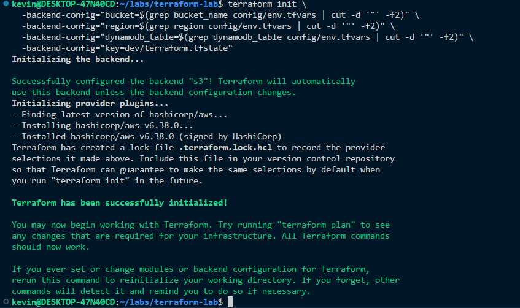
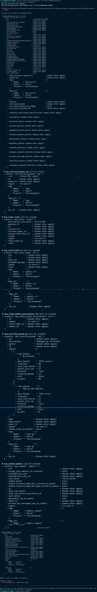
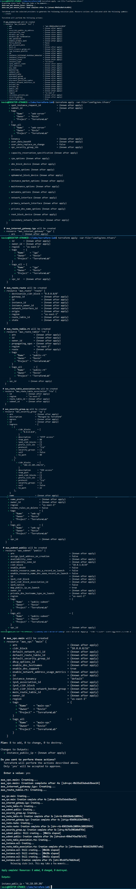
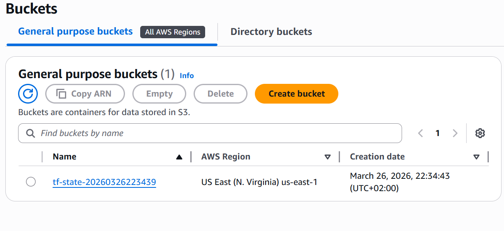
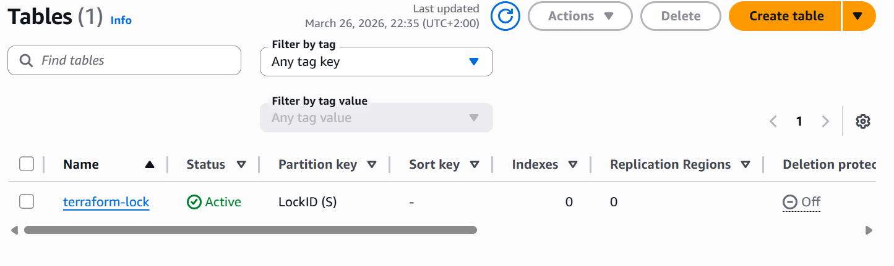
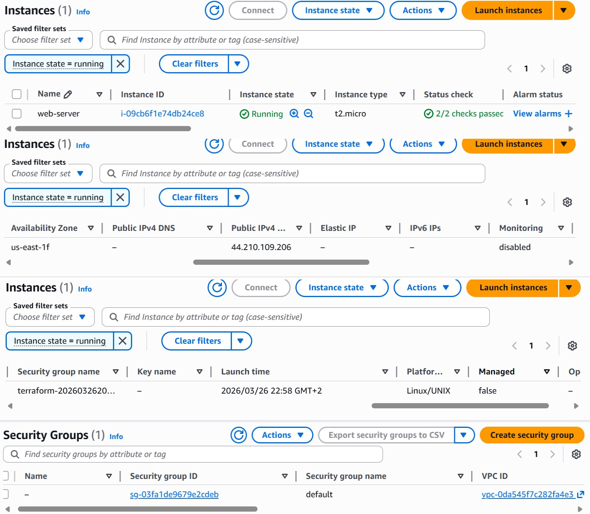
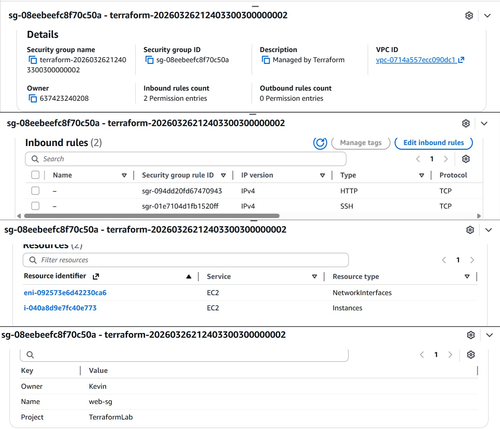
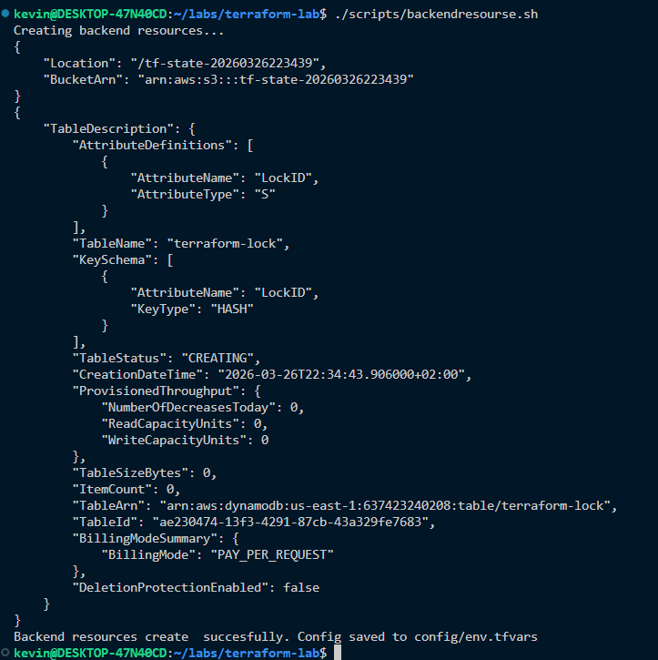
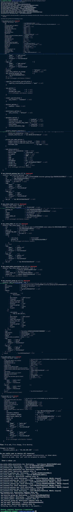
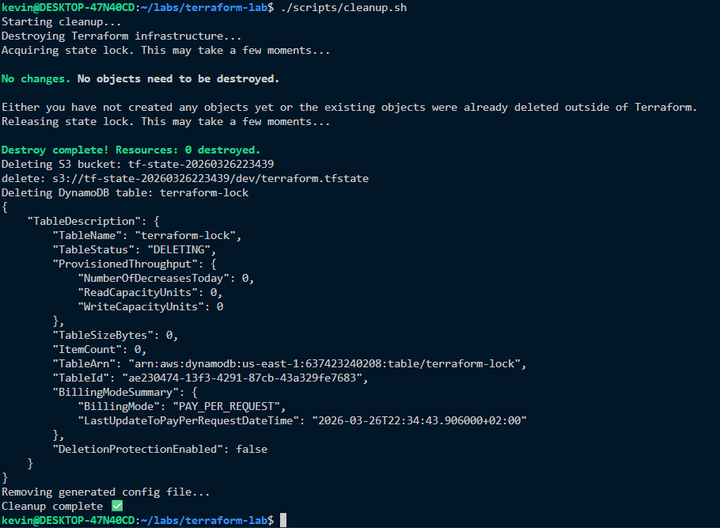

#  Terraform AWS Infrastructure Project

## Project Overview

This project demonstrates how to provision AWS infrastructure using **Terraform** following clean and professional DevOps practices.

The goal of this project is to:

* Avoid hardcoded values
* Use dynamic configuration
* Implement remote state management
* Apply proper AWS resource organization (tagging)

## Infrastructure Provisioned

The Terraform configuration creates the following resources:

* **VPC** – isolated network
* **Public Subnet** – for hosting public resources
* **Internet Gateway** – enables internet access
* **Route Table & Association** – routing configuration
* **Security Group** – controls inbound traffic:

  * SSH (restricted to your IP)
  * HTTP (open)
* **EC2 Instance** – running latest Amazon Linux (dynamic AMI)


## Project Structure

```bash
.
├── .gitignore
├── README.md
├── backend.tf
├── data.tf
├── locals.tf
├── main.tf
├── outputs.tf
├── provider.tf
├── variables.tf
├── screenshots/
│   ├── backend_configuration.png
│   ├── bucket.png
│   ├── dynamodb.png
│   ├── ec2.jpg
│   ├── s-group.jpg
│   ├── script-cleanup.png
│   ├── terraform-apply.jpg
│   ├── terraform-destroy.jpg
│   ├── terraform-init.png
│   └── terraform-plan.jpg
```

## Key Features

### Remote Backend (S3 + DynamoDB)

* S3 bucket stores Terraform state
* DynamoDB table enables state locking
* Prevents concurrent changes and state corruption


### Dynamic Configuration

* No hardcoded values
* Values such as region, bucket, and IP are injected via variables
* Improves reusability across environments


### Dynamic AMI Selection

* Uses Terraform `data` source
* Always fetches the latest Amazon Linux image
* Avoids outdated AMIs


### Resource Tagging

All resources include tags:

* `Name`
* `Project`
* `Owner`

This helps with:

* Cost tracking
* Resource organization
* Governance


### Clean Code Structure

* Separation of concerns (provider, data, resources, outputs)
* Use of `locals` to reduce repetition
* Variables used for flexibility


## Prerequisites

Before running this project, ensure you have:

* Terraform ≥ 1.5 installed
* AWS CLI installed and configured
* Valid AWS credentials with permissions for:

  * EC2
  * VPC
  * S3
  * DynamoDB


## Deployment Steps


### 1 Initialize Terraform

```bash
terraform init \
  -backend-config="bucket=$(grep bucket_name config/env.tfvars | cut -d '"' -f2)" \
  -backend-config="region=$(grep region config/env.tfvars | cut -d '"' -f2)" \
  -backend-config="dynamodb_table=$(grep dynamodb_table config/env.tfvars | cut -d '"' -f2)" \
  -backend-config="key=dev/terraform.tfstate"
```

 **Initialization Output:**




### 2️ Validate Execution Plan

```bash
terraform plan -var-file="config/env.tfvars"
```

**Plan Output:**




### 3️ Apply Infrastructure

```bash
terraform apply -var-file="config/env.tfvars"
```

**Apply Output:**




## AWS Resources Verification


### S3 Backend Bucket




### DynamoDB Table




### EC2 Instance




### Security Group




### Backend Configuration




## Outputs

To retrieve outputs:

```bash
terraform output
```

Example:

* EC2 Public IP

---

## Cleanup Process

To destroy infrastructure:

```bash
terraform destroy -var-file="config/env.tfvars"
```

 **Destroy Output:**




### Cleanup Script Execution

```bash
bash scripts/cleanup.sh
```

**Cleanup Script:**




## Design Decisions

### Why Remote Backend?

* Ensures state is stored securely
* Enables collaboration
* Prevents state conflicts


### Why Variables?

* Avoid hardcoding
* Improve flexibility
* Support reuse across environments


### Why Dynamic AMI?

* Keeps infrastructure up-to-date
* Avoids manual updates


### Why Tagging?

* Helps track resources
* Supports cost allocation
* Improves management in AWS


##  Author

**Kevin Ishimwe**
